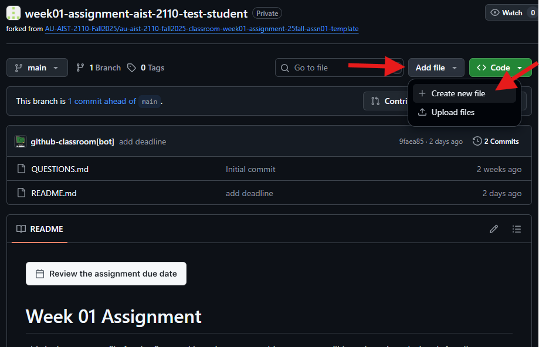
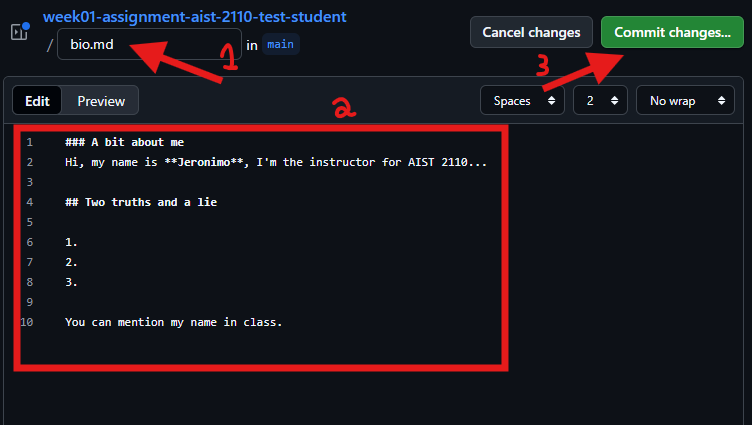
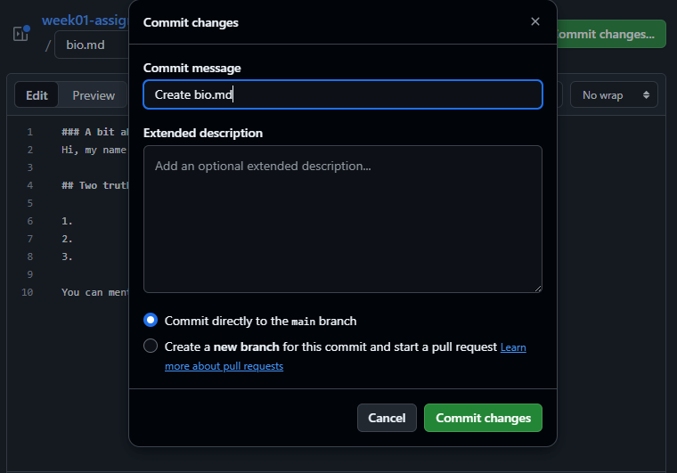
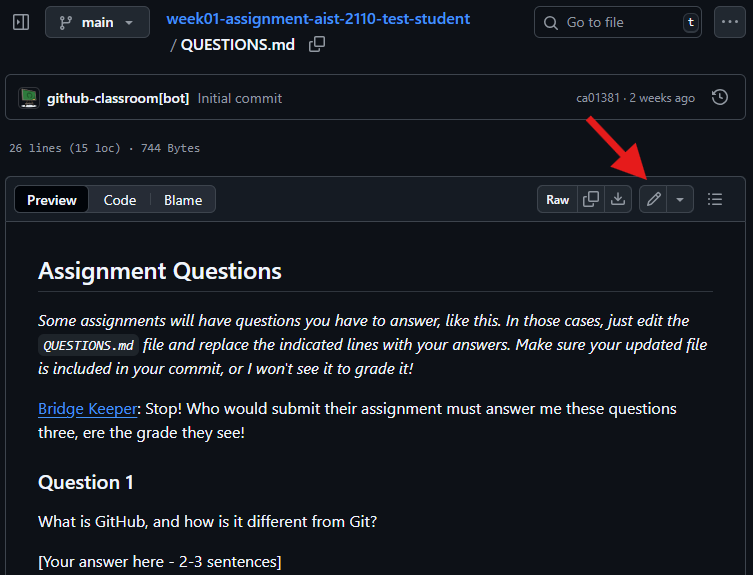
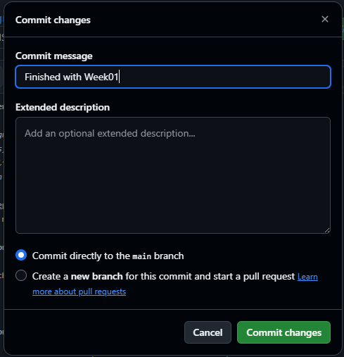

# Assign-01: Introduction to GitHub

Welcome to your first assignment! This guide will walk you through GitHub basics step-by-step to help you along the way.

## Learning Objectives

- Understand the difference between Git and GitHub
- Practice creating and editing files directly on GitHub
- Learn basic Markdown formatting
- Navigate between repositories in a GitHub organization

## Critical Information

**Assignment Submission:** We use Git/GitHub for ALL assignments. Nothing via D2L or email.

**Collaboration:** You may work with classmates, but submit your own work. 

**Final Commit Message:** When you finish the assignment, your last commit message should say something like: **"Finished with Assign-01"**

> **Important:** This is YOUR personal copy of the assignment. Changes you make here are only in your repository and won't affect other students. Only you and the instructor can see the changes made here.

---

## Assignment Tasks

### Task 1: GitHub Setup

**COMPLETED!** You're already here viewing your assignment repository!

---

### Task 2: Create Your Bio File

As I mentioned in class, I want to get to know you! Not just as a student, but as a person with your own stories and interests. Here's your chance to introduce yourself without standing up in front of everyone.
Include things that let me know a little about who you are, but you don't need to write a book.

Here's are some **ideas** to include in your bio:

- **Your name**
- Your major and year (e.g., "Computer Science, Junior")
- Where you're from
- What you expect to learn from this course
- What you hope to do after graduation
- Any hobbies, interests, favorite books/movies/games

> **Important:** End with two truths and a lie about yourself.

> Let me know if I can mention your fun facts in class

#### Step-by-Step Instructions:

**Step 1: Click "Add file" Button**

Look for the "Add file" button near the top right of your repository page, then select "Create new file":



**Step 2: Name Your File**

In the name field at the top, type exactly: `bio.md`

**Step 3: Write Your Bio**

Here's a template you can copy and modify:

```markdown
# About Me

**Name:** Your Name Here
**Major:** Your Major
**Year:** Freshman/Sophomore/Junior/Senior

## A Little About Me

[Write about yourself here. What are your interests? What brought you to this major? What are your goals?]

## Two Truths and a Lie

1. [First statement]
2. [Second statement]
3. [Third statement]

*You can mention my name and fun facts in class: Yes/No*
```



**Step 4: Save Your File**

1. Scroll up to find the "Commit changes" button
2. In the commit message box, type: `Create bio.md`
3. Click the green "Commit changes" button



> **Tip:** You can edit your bio file multiple times. Just click on the file, then click the pencil icon to edit.

---

### Task 3: Answer the Questions

Now let's answer some questions to test your understanding. Before you begin editing, review the questions and find the secret word you will need for Question 2.

**Step 1: Open and Review QUESTIONS.md**

Click on the `QUESTIONS.md` file in your repository's file list and read all three questions. Don't click the edit button yet.

**Step 2: Find the Secret Word for Question 2**

This step teaches you how to navigate between repositories in your class organization.

**Step 2A: Navigate to Your Class Organization**

There are two ways to get there:

**Option A: From Your Current Repository**

- Look at the top of the page where it shows your repository name
- Click on your organization name (it's the part before the `/` in the repository path)

**Option B: From GitHub Homepage**

- Click your profile picture (top right)
- Select "Your organizations"
- Click on your class organization

**Step 2B: Open the InClass-Examples Repository**

You should see at least two repositories:

- `assign-01-yourusername` (this one - where you are now)
- `InClass-Examples` (shared class repository)

Click on `InClass-Examples`

**Step 2C: Locate the Secret Word**

1. Click on the `Assign-01` folder
2. Look for a file that contains the secret word
3. Copy the secret word

#### Troubleshooting: Can't See InClass-Examples?

<details>
<summary>Click here if you can't find the InClass-Examples repository</summary>

You probably haven't accepted the organization invitation yet:

1. **Check your email** for an invitation from GitHub
2. **Check your spam folder** - invitations sometimes end up there
3. **Wait a bit** - invitations can take some time to arrive
4. **Verify your email** in GitHub settings if you haven't already
5. **Contact the instructor** for help

</details>

**Step 3: Return to Your Assignment and Edit QUESTIONS.md**

Navigate back to your assignment repository, open `QUESTIONS.md`, and click the pencil icon on the right side of the file view:



**Step 4: Answer All Three Questions**

Delete each `[Your answer here]` placeholder and type your answer. Paste the secret word you copied into your answer for Question 2.

**Step 5: Save Your Answers**

1. Scroll down to "Commit changes"
2. Type the commit message: `Finished with Assign-01`
3. Click "Commit changes"



---

## Final Check

When you've completed ALL tasks:

1. Make sure you have:
   - Created `bio.md` with your introduction
   - Answered all questions in `QUESTIONS.md` (including the secret word)
   - All files show in your repository's file list


---


## Getting Help

### Quick Fixes for Common Problems

| Problem | Solution |
|---------|----------|
| "I don't see the edit button" | Make sure you're logged in and viewing YOUR repository |
| "I lost my changes" | Check your commit history - GitHub saves everything you commit |
| "Permission denied" | You might be in the wrong repository - check the URL |
| "My file isn't showing up" | Did you click "Commit changes"? Check the file list again |
| "I used the wrong commit message" | That's okay! Just make another commit with the right message |


